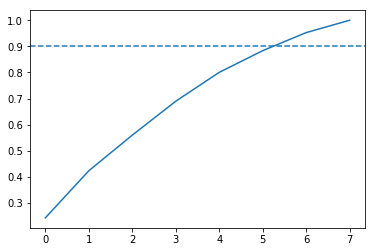

# Classification of Spotify Genres Using Machine Learning 


## 1. Preparing our dataset

```python
import pandas as pd
import warnings
warnings.filterwarnings("ignore", category=FutureWarning)

# Read in track metadata with genre labels
tracks = pd.read_csv('datasets/fma-rock-vs-hiphop.csv')
# Read in track metrics with the features
echonest_metrics = pd.read_json('datasets/echonest-metrics.json', precise_float=True)
# Merge the relevant columns of tracks and echonest_metrics
echo_tracks = echonest_metrics.merge(tracks[['track_id', 'genre_top']])
# Inspect the resultant dataframe
echo_tracks.info()
```

    <class 'pandas.core.frame.DataFrame'>
    Int64Index: 4802 entries, 0 to 4801
    Data columns (total 10 columns):
    track_id            4802 non-null int64
    acousticness        4802 non-null float64
    danceability        4802 non-null float64
    energy              4802 non-null float64
    instrumentalness    4802 non-null float64
    liveness            4802 non-null float64
    speechiness         4802 non-null float64
    tempo               4802 non-null float64
    valence             4802 non-null float64
    genre_top           4802 non-null object
    dtypes: float64(8), int64(1), object(1)
    memory usage: 412.7+ KB


## 2. Pairwise relationships between continuous variables


```python
# Create a correlation matrix
corr_metrics = echo_tracks.corr()
corr_metrics.style.background_gradient()
```


<style  type="text/css" >
    #T_efebfef8_18ab_11e9_af8d_a8206656fd86row0_col0 {
            background-color:  #023858;
        }    #T_efebfef8_18ab_11e9_af8d_a8206656fd86row0_col1 {
            background-color:  #fff7fb;
        }    #T_efebfef8_18ab_11e9_af8d_a8206656fd86row0_col2 {
            background-color:  #d2d2e7;
        }    #T_efebfef8_18ab_11e9_af8d_a8206656fd86row0_col3 {
            background-color:  #b5c4df;
        }    #T_efebfef8_18ab_11e9_af8d_a8206656fd86row0_col4 {
            background-color:  #f5eef6;
        }    #T_efebfef8_18ab_11e9_af8d_a8206656fd86row0_col5 {
            background-color:  #e9e5f1;
        }    #T_efebfef8_18ab_11e9_af8d_a8206656fd86row0_col6 {
            background-color:  #d1d2e6;
        }    #T_efebfef8_18ab_11e9_af8d_a8206656fd86row0_col7 {
            background-color:  #e1dfed;
        }    #T_efebfef8_18ab_11e9_af8d_a8206656fd86row0_col8 {
            background-color:  #dedcec;
        }    #T_efebfef8_18ab_11e9_af8d_a8206656fd86row1_col0 {
            background-color:  #fff7fb;
        }    #T_efebfef8_18ab_11e9_af8d_a8206656fd86row1_col1 {
            background-color:  #023858;
        }    #T_efebfef8_18ab_11e9_af8d_a8206656fd86row1_col2 {
            background-color:  #e0dded;
        }    #T_efebfef8_18ab_11e9_af8d_a8206656fd86row1_col3 {
            background-color:  #fff7fb;
        }    #T_efebfef8_18ab_11e9_af8d_a8206656fd86row1_col4 {
            background-color:  #97b7d7;
        }    #T_efebfef8_18ab_11e9_af8d_a8206656fd86row1_col5 {
            background-color:  #f3edf5;
        }    #T_efebfef8_18ab_11e9_af8d_a8206656fd86row1_col6 {
            background-color:  #b8c6e0;
        }    #T_efebfef8_18ab_11e9_af8d_a8206656fd86row1_col7 {
            background-color:  #e1dfed;
        }    #T_efebfef8_18ab_11e9_af8d_a8206656fd86row1_col8 {
            background-color:  #e2dfee;
        }    #T_efebfef8_18ab_11e9_af8d_a8206656fd86row2_col0 {
            background-color:  #bdc8e1;
        }    #T_efebfef8_18ab_11e9_af8d_a8206656fd86row2_col1 {
            background-color:  #d0d1e6;
        }    #T_efebfef8_18ab_11e9_af8d_a8206656fd86row2_col2 {
            background-color:  #023858;
        }    #T_efebfef8_18ab_11e9_af8d_a8206656fd86row2_col3 {
            background-color:  #fbf3f9;
        }    #T_efebfef8_18ab_11e9_af8d_a8206656fd86row2_col4 {
            background-color:  #f3edf5;
        }    #T_efebfef8_18ab_11e9_af8d_a8206656fd86row2_col5 {
            background-color:  #fff7fb;
        }    #T_efebfef8_18ab_11e9_af8d_a8206656fd86row2_col6 {
            background-color:  #80aed2;
        }    #T_efebfef8_18ab_11e9_af8d_a8206656fd86row2_col7 {
            background-color:  #fff7fb;
        }    #T_efebfef8_18ab_11e9_af8d_a8206656fd86row2_col8 {
            background-color:  #529bc7;
        }    #T_efebfef8_18ab_11e9_af8d_a8206656fd86row3_col0 {
            background-color:  #a7bddb;
        }    #T_efebfef8_18ab_11e9_af8d_a8206656fd86row3_col1 {
            background-color:  #f5eff6;
        }    #T_efebfef8_18ab_11e9_af8d_a8206656fd86row3_col2 {
            background-color:  #fef6fa;
        }    #T_efebfef8_18ab_11e9_af8d_a8206656fd86row3_col3 {
            background-color:  #023858;
        }    #T_efebfef8_18ab_11e9_af8d_a8206656fd86row3_col4 {
            background-color:  #c4cbe3;
        }    #T_efebfef8_18ab_11e9_af8d_a8206656fd86row3_col5 {
            background-color:  #dcdaeb;
        }    #T_efebfef8_18ab_11e9_af8d_a8206656fd86row3_col6 {
            background-color:  #dedcec;
        }    #T_efebfef8_18ab_11e9_af8d_a8206656fd86row3_col7 {
            background-color:  #adc1dd;
        }    #T_efebfef8_18ab_11e9_af8d_a8206656fd86row3_col8 {
            background-color:  #d9d8ea;
        }    #T_efebfef8_18ab_11e9_af8d_a8206656fd86row4_col0 {
            background-color:  #f4eef6;
        }    #T_efebfef8_18ab_11e9_af8d_a8206656fd86row4_col1 {
            background-color:  #97b7d7;
        }    #T_efebfef8_18ab_11e9_af8d_a8206656fd86row4_col2 {
            background-color:  #fff7fb;
        }    #T_efebfef8_18ab_11e9_af8d_a8206656fd86row4_col3 {
            background-color:  #d2d3e7;
        }    #T_efebfef8_18ab_11e9_af8d_a8206656fd86row4_col4 {
            background-color:  #023858;
        }    #T_efebfef8_18ab_11e9_af8d_a8206656fd86row4_col5 {
            background-color:  #fdf5fa;
        }    #T_efebfef8_18ab_11e9_af8d_a8206656fd86row4_col6 {
            background-color:  #fff7fb;
        }    #T_efebfef8_18ab_11e9_af8d_a8206656fd86row4_col7 {
            background-color:  #d9d8ea;
        }    #T_efebfef8_18ab_11e9_af8d_a8206656fd86row4_col8 {
            background-color:  #fff7fb;
        }    #T_efebfef8_18ab_11e9_af8d_a8206656fd86row5_col0 {
            background-color:  #bdc8e1;
        }    #T_efebfef8_18ab_11e9_af8d_a8206656fd86row5_col1 {
            background-color:  #ced0e6;
        }    #T_efebfef8_18ab_11e9_af8d_a8206656fd86row5_col2 {
            background-color:  #ede8f3;
        }    #T_efebfef8_18ab_11e9_af8d_a8206656fd86row5_col3 {
            background-color:  #bdc8e1;
        }    #T_efebfef8_18ab_11e9_af8d_a8206656fd86row5_col4 {
            background-color:  #dbdaeb;
        }    #T_efebfef8_18ab_11e9_af8d_a8206656fd86row5_col5 {
            background-color:  #023858;
        }    #T_efebfef8_18ab_11e9_af8d_a8206656fd86row5_col6 {
            background-color:  #c0c9e2;
        }    #T_efebfef8_18ab_11e9_af8d_a8206656fd86row5_col7 {
            background-color:  #dcdaeb;
        }    #T_efebfef8_18ab_11e9_af8d_a8206656fd86row5_col8 {
            background-color:  #e8e4f0;
        }    #T_efebfef8_18ab_11e9_af8d_a8206656fd86row6_col0 {
            background-color:  #d0d1e6;
        }    #T_efebfef8_18ab_11e9_af8d_a8206656fd86row6_col1 {
            background-color:  #b8c6e0;
        }    #T_efebfef8_18ab_11e9_af8d_a8206656fd86row6_col2 {
            background-color:  #93b5d6;
        }    #T_efebfef8_18ab_11e9_af8d_a8206656fd86row6_col3 {
            background-color:  #eae6f1;
        }    #T_efebfef8_18ab_11e9_af8d_a8206656fd86row6_col4 {
            background-color:  #fff7fb;
        }    #T_efebfef8_18ab_11e9_af8d_a8206656fd86row6_col5 {
            background-color:  #eae6f1;
        }    #T_efebfef8_18ab_11e9_af8d_a8206656fd86row6_col6 {
            background-color:  #023858;
        }    #T_efebfef8_18ab_11e9_af8d_a8206656fd86row6_col7 {
            background-color:  #dbdaeb;
        }    #T_efebfef8_18ab_11e9_af8d_a8206656fd86row6_col8 {
            background-color:  #bfc9e1;
        }    #T_efebfef8_18ab_11e9_af8d_a8206656fd86row7_col0 {
            background-color:  #d0d1e6;
        }    #T_efebfef8_18ab_11e9_af8d_a8206656fd86row7_col1 {
            background-color:  #d0d1e6;
        }    #T_efebfef8_18ab_11e9_af8d_a8206656fd86row7_col2 {
            background-color:  #fef6fa;
        }    #T_efebfef8_18ab_11e9_af8d_a8206656fd86row7_col3 {
            background-color:  #a7bddb;
        }    #T_efebfef8_18ab_11e9_af8d_a8206656fd86row7_col4 {
            background-color:  #c5cce3;
        }    #T_efebfef8_18ab_11e9_af8d_a8206656fd86row7_col5 {
            background-color:  #f0eaf4;
        }    #T_efebfef8_18ab_11e9_af8d_a8206656fd86row7_col6 {
            background-color:  #c8cde4;
        }    #T_efebfef8_18ab_11e9_af8d_a8206656fd86row7_col7 {
            background-color:  #023858;
        }    #T_efebfef8_18ab_11e9_af8d_a8206656fd86row7_col8 {
            background-color:  #d6d6e9;
        }    #T_efebfef8_18ab_11e9_af8d_a8206656fd86row8_col0 {
            background-color:  #c6cce3;
        }    #T_efebfef8_18ab_11e9_af8d_a8206656fd86row8_col1 {
            background-color:  #cdd0e5;
        }    #T_efebfef8_18ab_11e9_af8d_a8206656fd86row8_col2 {
            background-color:  #4c99c5;
        }    #T_efebfef8_18ab_11e9_af8d_a8206656fd86row8_col3 {
            background-color:  #d1d2e6;
        }    #T_efebfef8_18ab_11e9_af8d_a8206656fd86row8_col4 {
            background-color:  #efe9f3;
        }    #T_efebfef8_18ab_11e9_af8d_a8206656fd86row8_col5 {
            background-color:  #f7f0f7;
        }    #T_efebfef8_18ab_11e9_af8d_a8206656fd86row8_col6 {
            background-color:  #a5bddb;
        }    #T_efebfef8_18ab_11e9_af8d_a8206656fd86row8_col7 {
            background-color:  #d3d4e7;
        }    #T_efebfef8_18ab_11e9_af8d_a8206656fd86row8_col8 {
            background-color:  #023858;
        }</style>  
<table id="T_efebfef8_18ab_11e9_af8d_a8206656fd86" > 
<thead>    <tr> 
        <th class="blank level0" ></th> 
        <th class="col_heading level0 col0" >track_id</th> 
        <th class="col_heading level0 col1" >acousticness</th> 
        <th class="col_heading level0 col2" >danceability</th> 
        <th class="col_heading level0 col3" >energy</th> 
        <th class="col_heading level0 col4" >instrumentalness</th> 
        <th class="col_heading level0 col5" >liveness</th> 
        <th class="col_heading level0 col6" >speechiness</th> 
        <th class="col_heading level0 col7" >tempo</th> 
        <th class="col_heading level0 col8" >valence</th> 
    </tr></thead> 
<tbody>    <tr> 
        <th id="T_efebfef8_18ab_11e9_af8d_a8206656fd86level0_row0" class="row_heading level0 row0" >track_id</th> 
        <td id="T_efebfef8_18ab_11e9_af8d_a8206656fd86row0_col0" class="data row0 col0" >1</td> 
        <td id="T_efebfef8_18ab_11e9_af8d_a8206656fd86row0_col1" class="data row0 col1" >-0.372282</td> 
        <td id="T_efebfef8_18ab_11e9_af8d_a8206656fd86row0_col2" class="data row0 col2" >0.0494541</td> 
        <td id="T_efebfef8_18ab_11e9_af8d_a8206656fd86row0_col3" class="data row0 col3" >0.140703</td> 
        <td id="T_efebfef8_18ab_11e9_af8d_a8206656fd86row0_col4" class="data row0 col4" >-0.275623</td> 
        <td id="T_efebfef8_18ab_11e9_af8d_a8206656fd86row0_col5" class="data row0 col5" >0.0482307</td> 
        <td id="T_efebfef8_18ab_11e9_af8d_a8206656fd86row0_col6" class="data row0 col6" >-0.0269951</td> 
        <td id="T_efebfef8_18ab_11e9_af8d_a8206656fd86row0_col7" class="data row0 col7" >-0.0253918</td> 
        <td id="T_efebfef8_18ab_11e9_af8d_a8206656fd86row0_col8" class="data row0 col8" >0.0100698</td> 
    </tr>    <tr> 
        <th id="T_efebfef8_18ab_11e9_af8d_a8206656fd86level0_row1" class="row_heading level0 row1" >acousticness</th> 
        <td id="T_efebfef8_18ab_11e9_af8d_a8206656fd86row1_col0" class="data row1 col0" >-0.372282</td> 
        <td id="T_efebfef8_18ab_11e9_af8d_a8206656fd86row1_col1" class="data row1 col1" >1</td> 
        <td id="T_efebfef8_18ab_11e9_af8d_a8206656fd86row1_col2" class="data row1 col2" >-0.0289537</td> 
        <td id="T_efebfef8_18ab_11e9_af8d_a8206656fd86row1_col3" class="data row1 col3" >-0.281619</td> 
        <td id="T_efebfef8_18ab_11e9_af8d_a8206656fd86row1_col4" class="data row1 col4" >0.19478</td> 
        <td id="T_efebfef8_18ab_11e9_af8d_a8206656fd86row1_col5" class="data row1 col5" >-0.0199914</td> 
        <td id="T_efebfef8_18ab_11e9_af8d_a8206656fd86row1_col6" class="data row1 col6" >0.072204</td> 
        <td id="T_efebfef8_18ab_11e9_af8d_a8206656fd86row1_col7" class="data row1 col7" >-0.0263097</td> 
        <td id="T_efebfef8_18ab_11e9_af8d_a8206656fd86row1_col8" class="data row1 col8" >-0.0138406</td> 
    </tr>    <tr> 
        <th id="T_efebfef8_18ab_11e9_af8d_a8206656fd86level0_row2" class="row_heading level0 row2" >danceability</th> 
        <td id="T_efebfef8_18ab_11e9_af8d_a8206656fd86row2_col0" class="data row2 col0" >0.0494541</td> 
        <td id="T_efebfef8_18ab_11e9_af8d_a8206656fd86row2_col1" class="data row2 col1" >-0.0289537</td> 
        <td id="T_efebfef8_18ab_11e9_af8d_a8206656fd86row2_col2" class="data row2 col2" >1</td> 
        <td id="T_efebfef8_18ab_11e9_af8d_a8206656fd86row2_col3" class="data row2 col3" >-0.242032</td> 
        <td id="T_efebfef8_18ab_11e9_af8d_a8206656fd86row2_col4" class="data row2 col4" >-0.255217</td> 
        <td id="T_efebfef8_18ab_11e9_af8d_a8206656fd86row2_col5" class="data row2 col5" >-0.106584</td> 
        <td id="T_efebfef8_18ab_11e9_af8d_a8206656fd86row2_col6" class="data row2 col6" >0.276206</td> 
        <td id="T_efebfef8_18ab_11e9_af8d_a8206656fd86row2_col7" class="data row2 col7" >-0.242089</td> 
        <td id="T_efebfef8_18ab_11e9_af8d_a8206656fd86row2_col8" class="data row2 col8" >0.473165</td> 
    </tr>    <tr> 
        <th id="T_efebfef8_18ab_11e9_af8d_a8206656fd86level0_row3" class="row_heading level0 row3" >energy</th> 
        <td id="T_efebfef8_18ab_11e9_af8d_a8206656fd86row3_col0" class="data row3 col0" >0.140703</td> 
        <td id="T_efebfef8_18ab_11e9_af8d_a8206656fd86row3_col1" class="data row3 col1" >-0.281619</td> 
        <td id="T_efebfef8_18ab_11e9_af8d_a8206656fd86row3_col2" class="data row3 col2" >-0.242032</td> 
        <td id="T_efebfef8_18ab_11e9_af8d_a8206656fd86row3_col3" class="data row3 col3" >1</td> 
        <td id="T_efebfef8_18ab_11e9_af8d_a8206656fd86row3_col4" class="data row3 col4" >0.0282377</td> 
        <td id="T_efebfef8_18ab_11e9_af8d_a8206656fd86row3_col5" class="data row3 col5" >0.113331</td> 
        <td id="T_efebfef8_18ab_11e9_af8d_a8206656fd86row3_col6" class="data row3 col6" >-0.109983</td> 
        <td id="T_efebfef8_18ab_11e9_af8d_a8206656fd86row3_col7" class="data row3 col7" >0.195227</td> 
        <td id="T_efebfef8_18ab_11e9_af8d_a8206656fd86row3_col8" class="data row3 col8" >0.0386027</td> 
    </tr>    <tr> 
        <th id="T_efebfef8_18ab_11e9_af8d_a8206656fd86level0_row4" class="row_heading level0 row4" >instrumentalness</th> 
        <td id="T_efebfef8_18ab_11e9_af8d_a8206656fd86row4_col0" class="data row4 col0" >-0.275623</td> 
        <td id="T_efebfef8_18ab_11e9_af8d_a8206656fd86row4_col1" class="data row4 col1" >0.19478</td> 
        <td id="T_efebfef8_18ab_11e9_af8d_a8206656fd86row4_col2" class="data row4 col2" >-0.255217</td> 
        <td id="T_efebfef8_18ab_11e9_af8d_a8206656fd86row4_col3" class="data row4 col3" >0.0282377</td> 
        <td id="T_efebfef8_18ab_11e9_af8d_a8206656fd86row4_col4" class="data row4 col4" >1</td> 
        <td id="T_efebfef8_18ab_11e9_af8d_a8206656fd86row4_col5" class="data row4 col5" >-0.0910218</td> 
        <td id="T_efebfef8_18ab_11e9_af8d_a8206656fd86row4_col6" class="data row4 col6" >-0.366762</td> 
        <td id="T_efebfef8_18ab_11e9_af8d_a8206656fd86row4_col7" class="data row4 col7" >0.022215</td> 
        <td id="T_efebfef8_18ab_11e9_af8d_a8206656fd86row4_col8" class="data row4 col8" >-0.219967</td> 
    </tr>    <tr> 
        <th id="T_efebfef8_18ab_11e9_af8d_a8206656fd86level0_row5" class="row_heading level0 row5" >liveness</th> 
        <td id="T_efebfef8_18ab_11e9_af8d_a8206656fd86row5_col0" class="data row5 col0" >0.0482307</td> 
        <td id="T_efebfef8_18ab_11e9_af8d_a8206656fd86row5_col1" class="data row5 col1" >-0.0199914</td> 
        <td id="T_efebfef8_18ab_11e9_af8d_a8206656fd86row5_col2" class="data row5 col2" >-0.106584</td> 
        <td id="T_efebfef8_18ab_11e9_af8d_a8206656fd86row5_col3" class="data row5 col3" >0.113331</td> 
        <td id="T_efebfef8_18ab_11e9_af8d_a8206656fd86row5_col4" class="data row5 col4" >-0.0910218</td> 
        <td id="T_efebfef8_18ab_11e9_af8d_a8206656fd86row5_col5" class="data row5 col5" >1</td> 
        <td id="T_efebfef8_18ab_11e9_af8d_a8206656fd86row5_col6" class="data row5 col6" >0.0411725</td> 
        <td id="T_efebfef8_18ab_11e9_af8d_a8206656fd86row5_col7" class="data row5 col7" >0.00273169</td> 
        <td id="T_efebfef8_18ab_11e9_af8d_a8206656fd86row5_col8" class="data row5 col8" >-0.0450931</td> 
    </tr>    <tr> 
        <th id="T_efebfef8_18ab_11e9_af8d_a8206656fd86level0_row6" class="row_heading level0 row6" >speechiness</th> 
        <td id="T_efebfef8_18ab_11e9_af8d_a8206656fd86row6_col0" class="data row6 col0" >-0.0269951</td> 
        <td id="T_efebfef8_18ab_11e9_af8d_a8206656fd86row6_col1" class="data row6 col1" >0.072204</td> 
        <td id="T_efebfef8_18ab_11e9_af8d_a8206656fd86row6_col2" class="data row6 col2" >0.276206</td> 
        <td id="T_efebfef8_18ab_11e9_af8d_a8206656fd86row6_col3" class="data row6 col3" >-0.109983</td> 
        <td id="T_efebfef8_18ab_11e9_af8d_a8206656fd86row6_col4" class="data row6 col4" >-0.366762</td> 
        <td id="T_efebfef8_18ab_11e9_af8d_a8206656fd86row6_col5" class="data row6 col5" >0.0411725</td> 
        <td id="T_efebfef8_18ab_11e9_af8d_a8206656fd86row6_col6" class="data row6 col6" >1</td> 
        <td id="T_efebfef8_18ab_11e9_af8d_a8206656fd86row6_col7" class="data row6 col7" >0.00824055</td> 
        <td id="T_efebfef8_18ab_11e9_af8d_a8206656fd86row6_col8" class="data row6 col8" >0.149894</td> 
    </tr>    <tr> 
        <th id="T_efebfef8_18ab_11e9_af8d_a8206656fd86level0_row7" class="row_heading level0 row7" >tempo</th> 
        <td id="T_efebfef8_18ab_11e9_af8d_a8206656fd86row7_col0" class="data row7 col0" >-0.0253918</td> 
        <td id="T_efebfef8_18ab_11e9_af8d_a8206656fd86row7_col1" class="data row7 col1" >-0.0263097</td> 
        <td id="T_efebfef8_18ab_11e9_af8d_a8206656fd86row7_col2" class="data row7 col2" >-0.242089</td> 
        <td id="T_efebfef8_18ab_11e9_af8d_a8206656fd86row7_col3" class="data row7 col3" >0.195227</td> 
        <td id="T_efebfef8_18ab_11e9_af8d_a8206656fd86row7_col4" class="data row7 col4" >0.022215</td> 
        <td id="T_efebfef8_18ab_11e9_af8d_a8206656fd86row7_col5" class="data row7 col5" >0.00273169</td> 
        <td id="T_efebfef8_18ab_11e9_af8d_a8206656fd86row7_col6" class="data row7 col6" >0.00824055</td> 
        <td id="T_efebfef8_18ab_11e9_af8d_a8206656fd86row7_col7" class="data row7 col7" >1</td> 
        <td id="T_efebfef8_18ab_11e9_af8d_a8206656fd86row7_col8" class="data row7 col8" >0.0522212</td> 
    </tr>    <tr> 
        <th id="T_efebfef8_18ab_11e9_af8d_a8206656fd86level0_row8" class="row_heading level0 row8" >valence</th> 
        <td id="T_efebfef8_18ab_11e9_af8d_a8206656fd86row8_col0" class="data row8 col0" >0.0100698</td> 
        <td id="T_efebfef8_18ab_11e9_af8d_a8206656fd86row8_col1" class="data row8 col1" >-0.0138406</td> 
        <td id="T_efebfef8_18ab_11e9_af8d_a8206656fd86row8_col2" class="data row8 col2" >0.473165</td> 
        <td id="T_efebfef8_18ab_11e9_af8d_a8206656fd86row8_col3" class="data row8 col3" >0.0386027</td> 
        <td id="T_efebfef8_18ab_11e9_af8d_a8206656fd86row8_col4" class="data row8 col4" >-0.219967</td> 
        <td id="T_efebfef8_18ab_11e9_af8d_a8206656fd86row8_col5" class="data row8 col5" >-0.0450931</td> 
        <td id="T_efebfef8_18ab_11e9_af8d_a8206656fd86row8_col6" class="data row8 col6" >0.149894</td> 
        <td id="T_efebfef8_18ab_11e9_af8d_a8206656fd86row8_col7" class="data row8 col7" >0.0522212</td> 
        <td id="T_efebfef8_18ab_11e9_af8d_a8206656fd86row8_col8" class="data row8 col8" >1</td> 
    </tr></tbody> 
</table> 


## 3. Normalizing the feature data


```python
# Define our features 
features = echo_tracks.drop(['genre_top','track_id'], axis=1)

# Define our labels
labels = echo_tracks['genre_top']

# Import the StandardScaler
from sklearn.preprocessing import StandardScaler

# Scale the features and set the values to a new variable
scaler = StandardScaler()
scaled_train_features = scaler.fit_transform(features)
```

## 4. Principal Component Analysis on our scaled data


```python
# This is just to make plots appear in the notebook
%matplotlib inline

# Import our plotting module, and PCA class
import matplotlib.pyplot as plt
from sklearn.decomposition import PCA

# Get our explained variance ratios from PCA using all features
pca = PCA()
pca.fit(scaled_train_features)
exp_variance = pca.explained_variance_ratio_
print(pca.explained_variance_ratio_)
print(pca.n_components_)
# plot the explained variance using a barplot
fig, ax = plt.subplots()
ax.bar(range(pca.n_components_), exp_variance)
ax.set_xlabel('Principal Component #')
```

    [0.24297674 0.18044316 0.13650309 0.12994089 0.11056248 0.08302245
     0.06923783 0.04731336]
    8


    Text(0.5,0,'Principal Component #')


## 5. Further visualization of PCA

```python
# Import numpy
import numpy as np

# Calculate the cumulative explained variance
cum_exp_variance = np.cumsum(exp_variance)

# Plot the cumulative explained variance and draw a dashed line at 0.90.
fig, ax = plt.subplots()
ax.plot(cum_exp_variance)
ax.axhline(y=0.9, linestyle='--')
n_components = 6

# Perform PCA with the chosen number of components and project data onto components
pca = PCA(n_components, random_state=10)
pca.fit(scaled_train_features)
pca_projection = pca.transform(scaled_train_features)
```





## 6. Train a decision tree to classify genre


```python
# Import train_test_split function and Decision tree classifier
from sklearn.model_selection import train_test_split
from sklearn.tree import DecisionTreeClassifier

# Split our data
train_features, test_features, train_labels, test_labels = train_test_split(pca_projection, labels, random_state=10)

# Train our decision tree
tree = DecisionTreeClassifier(random_state=10)
tree.fit(train_features,train_labels)

# Predict the labels for the test data
pred_labels_tree = tree.predict(test_features)

```

## 7. Compare our decision tree to a logistic regression


```python
# Import LogisticRegression
from sklearn.linear_model import LogisticRegression

# Train our logistic regression and predict labels for the test set
logreg = LogisticRegression(random_state=10)
logreg.fit(train_features, train_labels)
pred_labels_logit = logreg.predict(test_features)

# Create the classification report for both models
from sklearn.metrics import classification_report
class_rep_tree = classification_report(test_labels,pred_labels_tree)
class_rep_log = classification_report(test_labels,pred_labels_logit)

print("Decision Tree: \n", class_rep_tree)
print("Logistic Regression: \n", class_rep_log)
```

    Decision Tree: 
                   precision    recall  f1-score   support
    
         Hip-Hop       0.66      0.66      0.66       229
            Rock       0.92      0.92      0.92       972
    
       micro avg       0.87      0.87      0.87      1201
       macro avg       0.79      0.79      0.79      1201
    weighted avg       0.87      0.87      0.87      1201
    
    Logistic Regression: 
                   precision    recall  f1-score   support
    
         Hip-Hop       0.75      0.57      0.65       229
            Rock       0.90      0.95      0.93       972
    
       micro avg       0.88      0.88      0.88      1201
       macro avg       0.83      0.76      0.79      1201
    weighted avg       0.87      0.88      0.87      1201
    


## 8. Balance our data for greater performance

```python
# Subset only the hip-hop tracks, and then only the rock tracks
hop_only = echo_tracks.loc[echo_tracks['genre_top'] == 'Hip-Hop']
rock_only = echo_tracks.loc[echo_tracks['genre_top'] == 'Rock']

# sample the rocks songs to be the same number as there are hip-hop songs
rock_only = rock_only.sample(len(hop_only),random_state=10)

# concatenate the dataframes rock_only and hop_only
rock_hop_bal = pd.concat([rock_only,hop_only])

# The features, labels, and pca projection are created for the balanced dataframe
features = rock_hop_bal.drop(['genre_top', 'track_id'], axis=1) 
labels = rock_hop_bal['genre_top']
pca_projection = pca.fit_transform(scaler.fit_transform(features))

# Redefine the train and test set with the pca_projection from the balanced data
train_features, test_features, train_labels, test_labels = train_test_split(pca_projection,labels, random_state=10)
```

## 9. Does balancing our dataset improve model bias?


```python
# Train our decision tree on the balanced data
tree = DecisionTreeClassifier(random_state=10)
tree.fit(train_features,train_labels)
pred_labels_tree = tree.predict(test_features)

# Train our logistic regression on the balanced data
logreg = LogisticRegression()
logreg.fit(train_features,train_labels)
pred_labels_logit = logreg.predict(test_features)

# Compare the models
print("Decision Tree: \n", classification_report(test_labels,pred_labels_tree ))
print("Logistic Regression: \n", classification_report(test_labels,pred_labels_logit))
```

    Decision Tree: 
                   precision    recall  f1-score   support
    
         Hip-Hop       0.77      0.77      0.77       230
            Rock       0.76      0.76      0.76       225
    
       micro avg       0.76      0.76      0.76       455
       macro avg       0.76      0.76      0.76       455
    weighted avg       0.76      0.76      0.76       455
    
    Logistic Regression: 
                   precision    recall  f1-score   support
    
         Hip-Hop       0.82      0.83      0.82       230
            Rock       0.82      0.81      0.82       225
    
       micro avg       0.82      0.82      0.82       455
       macro avg       0.82      0.82      0.82       455
    weighted avg       0.82      0.82      0.82       455
    


## 10. Using cross-validation to evaluate our models

```python
from sklearn.model_selection import KFold, cross_val_score

# Set up our K-fold cross-validation
kf = KFold(10, random_state=10)

tree = DecisionTreeClassifier(random_state=10)
logreg = LogisticRegression(random_state=10)

# Train our models using KFold cv
tree_score = cross_val_score(tree, pca_projection,labels,cv=kf)
logit_score = cross_val_score(logreg,pca_projection,labels,cv=kf)

# Print the mean of each array of scores
print("Decision Tree:", np.mean(tree_score), "Logistic Regression:", np.mean(logit_score))

```

    Decision Tree: 0.7241758241758242 Logistic Regression: 0.7752747252747252


```python

```
