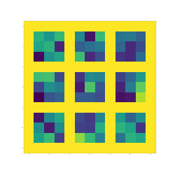

---
---

# Audio Classifier Using Convolutional Neural Networks

I wanted to expore the possiblity of training more then just two classes for an audio classifier. I then wanted to use this classfier to correctly idenify beatbox beats as a kick snare or high hat. This will eventually be used along side midi to convert beatboxes to midi information. Below is the end to end sequence of training, loading, and predicting a model. The Gif created shows how the model is learning what the best filters for the first convolutional layer are for classifing.


```python
import sys

# Now get necessary libraries
import os
import numpy as np
import matplotlib.pyplot as plt
from skimage.transform import resize
from skimage import data
from scipy.misc import imresize
import IPython.display as ipyd

# Import Tensorflow
import tensorflow as tf

from libs import utils, gif, datasets, dataset_utils, dft
```


```python
# Load Wav files

dst = 'dataset/'

kick_dir = os.path.join(os.path.join(dst, 'training'), 'kick')
kick = [os.path.join(kick_dir, file_i)
          for file_i in os.listdir(kick_dir)
          if file_i.endswith('.wav')]

snare_dir = os.path.join(os.path.join(dst, 'training'), 'snare')
snare = [os.path.join(snare_dir, file_i)
          for file_i in os.listdir(snare_dir)
          if file_i.endswith('.wav')]

hihat_dir = os.path.join(os.path.join(dst, 'training'), 'hihat')
hihat = [os.path.join(hihat_dir, file_i)
          for file_i in os.listdir(hihat_dir)
          if file_i.endswith('.wav')]
```


```python
#Audio Dsp and spectrogram setup

fft_size = 512
hop_size = 256
sr = 44100

# which will tell us how many frames of magnitudes
# we have per second
n_frames_per_second = sr // hop_size

# We want 500 milliseconds of audio in our window
n_frames = (n_frames_per_second // 4) //3

# And we'll move our window by 250 ms at a time
frame_hops = (n_frames_per_second // 8)//3
```


```python
# Store every magnitude frame and its label. 0=kick, 1=snare, 2=hihat
Xs, ys = [], []

# Let's start with the music files
for i in kick:
    # Load the ith file:
    s = utils.load_audio(i)
    
    # Now take the dft of it (take a DSP course!):
    re, im = dft.dft_np(s, fft_size=fft_size, hop_size=hop_size)
    
    # And convert the complex representation to magnitudes/phases (take a DSP course!):
    mag, phs = dft.ztoc(re, im)
    
    # This is how many sliding windows we have:
    n_hops = (len(mag) - n_frames) // frame_hops
    
    # Let's extract them all:
    for hop_i in range(n_hops):
        
        # Get the current sliding window
        frames = mag[(hop_i * frame_hops):(hop_i * frame_hops + n_frames)]
        
        # We'll take the log magnitudes, as this is a nicer representation:
        this_X = np.log(np.abs(frames[..., np.newaxis]) + 1e-10)
        
        # And store it:
        Xs.append(this_X)
        
        # And be sure that we store the correct label of this observation:
        ys.append(0)
        
for i in snare:
    
    s = utils.load_audio(i)
    
    re, im = dft.dft_np(s, fft_size=fft_size, hop_size=hop_size)
    mag, phs = dft.ztoc(re, im)
    n_hops = (len(mag) - n_frames) // frame_hops

    for hop_i in range(n_hops):
        
        frames = mag[(hop_i * frame_hops):(hop_i * frame_hops + n_frames)]
        
        this_X = np.log(np.abs(frames[..., np.newaxis]) + 1e-10)
        
        Xs.append(this_X)
        ys.append(1)

for i in hihat:
    
    s = utils.load_audio(i)
    
    re, im = dft.dft_np(s, fft_size=fft_size, hop_size=hop_size)
    mag, phs = dft.ztoc(re, im)
    n_hops = (len(mag) - n_frames) // frame_hops

    for hop_i in range(n_hops):
        
        frames = mag[(hop_i * frame_hops):(hop_i * frame_hops + n_frames)]
        
        this_X = np.log(np.abs(frames[..., np.newaxis]) + 1e-10)
        
        Xs.append(this_X)
        ys.append(2)

```


```python
# Convert them to an array:
Xs = np.array(Xs)
ys = np.array(ys)
print(Xs.shape)
```

    (13263, 14, 256, 1)


```python
#Visual one of the spectrograms in training data

plt.imshow(Xs[13262][..., 0])

```


    <matplotlib.image.AxesImage at 0x1c2f20bc88>


```python
#split the dataset into validation training and testing
ds = datasets.Dataset(Xs=Xs, ys=ys, split=[0.8, 0.1, 0.1], one_hot=True)
Xs_i, ys_i = next(ds.train.next_batch())
```


```python
# Create the input to the network (make sure input shape is same size as data by grabbing Xs shape):
X = tf.placeholder(name='X', shape=[None, Xs.shape[1], Xs.shape[2], 1], dtype=tf.float32)

# Create the output to the network. output shape must be same size as number of classes trained on!
Y = tf.placeholder(name='Y', shape=[None, 3], dtype=tf.float32)

```


```python
# numbers of layers and sizes of the network
n_filters = [9, 9, 9, 9]

# Now let's loop over our n_filters and create the deep convolutional neural network
H = X
for layer_i, n_filters_i in enumerate(n_filters):
    
    # Let's use the helper function to create our connection to the next layer:
    H, W = utils.conv2d(
        H, n_filters_i, k_h=3, k_w=3, d_h=2, d_w=2,
        name=str(layer_i))
    
    # And use a nonlinearity
    H = tf.nn.relu(H)

```


```python
# Connect the last convolutional layer to a fully connected network 
fc, W = utils.linear(H, n_output=4, activation=tf.nn.relu, name='lastlayer')

# And another fully connected layer, n_outputs must be same as number of classes training on. 
Y_pred, W = utils.linear(fc, n_output=3, activation=tf.nn.softmax, name='outputlayer')
```


```python
# Now create our cost function based on predicted Y value being correct against the actual Y value

predicted_y = tf.argmax(Y_pred, 1)
actual_y = tf.argmax(Y, 1)

correct_prediction = tf.equal(predicted_y, actual_y)
accuracy = tf.reduce_mean(tf.cast(correct_prediction, "float"))


# create an optimizer with cross_entropy as it is more then two classes:

cross_entropy = -tf.reduce_sum(Y * tf.log(Y_pred + 1e-12))
optimizer = tf.train.AdamOptimizer(0.001).minimize(cross_entropy)

```


```python
# create init parameters and train!
n_epochs = 100
batch_size = 10


# Create a session and init!
sess = tf.Session()
sess.run(tf.global_variables_initializer())
model_saver = tf.train.Saver()

#for grabbing convo layer 1 image
g = tf.get_default_graph()

# Now iterate over our dataset n_epoch times
for epoch_i in range(n_epochs):
    print('Epoch: ', epoch_i)
    
    # Train
    this_accuracy = 0
    its = 0
    
    # Do our mini batches:
    for Xs_i, ys_i in ds.train.next_batch(batch_size):
        # Note here: we are running the optimizer so
        # that the network parameters train!
        this_accuracy += sess.run([accuracy, optimizer], feed_dict={
                X:Xs_i, Y:ys_i})[0]
        its += 1
        # print(this_accuracy / its)
 
    W = g.get_tensor_by_name('0/W:0')
    W = W.eval(session=sess)
    m = utils.montage_filters(W)
    plt.figure(figsize=(15, 15))
    plt.imshow(m)
    plt.savefig('output/audio{}.png'.format(epoch_i), dpi=15)

    print('Training accuracy: ', this_accuracy / its)
    
    # Validation (see how the network does on unseen data).
    this_accuracy = 0
    its = 0
    
    # Do our mini batches:
    for Xs_i, ys_i in ds.valid.next_batch(batch_size):
        # Note here: we are NOT running the optimizer!
        # we only measure the accuracy!
        this_accuracy += sess.run(accuracy, feed_dict={
                X:Xs_i, Y:ys_i})
        its += 1
    print('Validation accuracy: ', this_accuracy / its)

    # Train the model and save it in the end
    model_saver.save(sess, "saved_models/beatbox.ckpt")


```

    Epoch:  0
    Training accuracy:  0.47360980882889586
    Validation accuracy:  0.5694235627700511
    Epoch:  1
    Training accuracy:  0.601790768528861
    Validation accuracy:  0.6200501293616187
    Epoch:  2
    Training accuracy:  0.6457115952048406
    Validation accuracy:  0.611528826387305
    Epoch:  3
    Training accuracy:  0.6628652243092866
    Validation accuracy:  0.6553884765931538
    Epoch:  4
    Training accuracy:  0.6901036779713113
    Validation accuracy:  0.688471182620615
    Epoch:  5
    Training accuracy:  0.7037700300335772
    Validation accuracy:  0.7273182956347788
    Epoch:  6
    Training accuracy:  0.7223374187019386
    Validation accuracy:  0.6949874685895174
    Epoch:  7
    Training accuracy:  0.7399622995711856
    Validation accuracy:  0.6924812056516346
    Epoch:  8
    Training accuracy:  0.7536286511699846
    Validation accuracy:  0.7491228078541002
    Epoch:  9
    Training accuracy:  0.7673892542565353
    Validation accuracy:  0.750626566266655
    Epoch:  10
    Training accuracy:  0.7816211102314427
    Validation accuracy:  0.7551378453136387
    Epoch:  11
    Training accuracy:  0.7957587144096205
    Validation accuracy:  0.7731829566839046
    Epoch:  12
    Training accuracy:  0.8040527764858781
    Validation accuracy:  0.7714285698152126
    Epoch:  13
    Training accuracy:  0.8126295911434346
    Validation accuracy:  0.8002506216665856
    Epoch:  14
    Training accuracy:  0.816305368183695
    Validation accuracy:  0.8055137812643123
    Epoch:  15
    Training accuracy:  0.827803953934345
    Validation accuracy:  0.8132832043601158
    Epoch:  16
    Training accuracy:  0.8344015031069882
    Validation accuracy:  0.8072681677968878
    Epoch:  17
    Training accuracy:  0.8352497604857291
    Validation accuracy:  0.8047619020580349
    Epoch:  18
    Training accuracy:  0.8462770925334442
    Validation accuracy:  0.8130325798253367
    Epoch:  19
    Training accuracy:  0.8482563566139124
    Validation accuracy:  0.816791976753034
    Epoch:  20


    /anaconda3/lib/python3.6/site-packages/matplotlib/pyplot.py:537: RuntimeWarning: More than 20 figures have been opened. Figures created through the pyplot interface (`matplotlib.pyplot.figure`) are retained until explicitly closed and may consume too much memory. (To control this warning, see the rcParam `figure.max_open_warning`).
      max_open_warning, RuntimeWarning)


    Training accuracy:  0.8482563565436901
    Validation accuracy:  0.8100250591909078
    Epoch:  21
    Training accuracy:  0.8521206350847869
    Validation accuracy:  0.8142857112382588
    Epoch:  22
    Training accuracy:  0.8580584299946371
    Validation accuracy:  0.8245613991766048
    Epoch:  23
    Training accuracy:  0.8581526803588327
    Validation accuracy:  0.82305764076405
    Epoch:  24
    Training accuracy:  0.8653157338233178
    Validation accuracy:  0.8145363384619692
    Epoch:  25
    Training accuracy:  0.865504234888776
    Validation accuracy:  0.814035085359014
    Epoch:  26
    Training accuracy:  0.865032981522908
    Validation accuracy:  0.8245613991766048
    Epoch:  27
    Training accuracy:  0.8654099846931137
    Validation accuracy:  0.8233082661951395
    Epoch:  28
    Training accuracy:  0.868426006712181
    Validation accuracy:  0.8152882154274704
    Epoch:  29
    Training accuracy:  0.870970775646269
    Validation accuracy:  0.7962405988596436
    Epoch:  30
    Training accuracy:  0.8741752997981727
    Validation accuracy:  0.8195488681470541
    Epoch:  31
    Training accuracy:  0.8776625756044415
    Validation accuracy:  0.8035087675080264
    Epoch:  32
    Training accuracy:  0.878228079699661
    Validation accuracy:  0.8350877145627388
    Epoch:  33
    Training accuracy:  0.8763430660114774
    Validation accuracy:  0.8273182914669353
    Epoch:  34
    Training accuracy:  0.8811498518039549
    Validation accuracy:  0.8195488690433645
    Epoch:  35
    Training accuracy:  0.88350611902654
    Validation accuracy:  0.83609021785564
    Epoch:  36
    Training accuracy:  0.8812441031231731
    Validation accuracy:  0.8190476163885647
    Epoch:  37
    Training accuracy:  0.8842601244400179
    Validation accuracy:  0.8318295698416861
    Epoch:  38
    Training accuracy:  0.886145138830424
    Validation accuracy:  0.8333333291505512
    Epoch:  39
    Training accuracy:  0.8882186543143773
    Validation accuracy:  0.8285714257928661
    Epoch:  40
    Training accuracy:  0.8868048933179282
    Validation accuracy:  0.8315789430661309
    Epoch:  41
    Training accuracy:  0.8872761472174854
    Validation accuracy:  0.8213032528870088
    Epoch:  42
    Training accuracy:  0.8898209162639291
    Validation accuracy:  0.8310776913076415
    Epoch:  43
    Training accuracy:  0.8938736968957288
    Validation accuracy:  0.8348370871149507
    Epoch:  44
    Training accuracy:  0.8951932063763373
    Validation accuracy:  0.8398496185926566
    Epoch:  45
    Training accuracy:  0.8937794461663774
    Validation accuracy:  0.8370927263023262
    Epoch:  46
    Training accuracy:  0.8978322263206658
    Validation accuracy:  0.829573929309845
    Epoch:  47
    Training accuracy:  0.8961357129957179
    Validation accuracy:  0.8137844561186052
    Epoch:  48
    Training accuracy:  0.8958529620997531
    Validation accuracy:  0.828320799017311
    Epoch:  49
    Training accuracy:  0.89632421524091
    Validation accuracy:  0.8370927254060158
    Epoch:  50
    Training accuracy:  0.8973609721683086
    Validation accuracy:  0.8365914745438368
    Epoch:  51
    Training accuracy:  0.9034872685368616
    Validation accuracy:  0.832330820703865
    Epoch:  52
    Training accuracy:  0.8985862320712105
    Validation accuracy:  0.8353383402179059
    Epoch:  53
    Training accuracy:  0.9020735084954351
    Validation accuracy:  0.8313283153942653
    Epoch:  54
    Training accuracy:  0.9004712453661495
    Validation accuracy:  0.8305764355157551
    Epoch:  55
    Training accuracy:  0.9011310003030761
    Validation accuracy:  0.8411027493333458
    Epoch:  56
    Training accuracy:  0.9020735077651237
    Validation accuracy:  0.8308270625153878
    Epoch:  57
    Training accuracy:  0.9038642717632452
    Validation accuracy:  0.8363408477682817
    Epoch:  58
    Training accuracy:  0.9032045163207184
    Validation accuracy:  0.8401002444719013
    Epoch:  59
    Training accuracy:  0.9059377869943984
    Validation accuracy:  0.8350877129941955
    Epoch:  60
    Training accuracy:  0.9067860436147389
    Validation accuracy:  0.822556387661095
    Epoch:  61
    Training accuracy:  0.9078228021432048
    Validation accuracy:  0.8273182901224696
    Epoch:  62
    Training accuracy:  0.9073515484964477
    Validation accuracy:  0.8421052586763424
    Epoch:  63
    Training accuracy:  0.9107445728430537
    Validation accuracy:  0.837844606404914
    Epoch:  64
    Training accuracy:  0.9106503221698801
    Validation accuracy:  0.835588966993461
    Epoch:  65
    Training accuracy:  0.9076342997294794
    Validation accuracy:  0.8308270622913102
    Epoch:  66
    Training accuracy:  0.906126288790168
    Validation accuracy:  0.821052629920773
    Epoch:  67
    Training accuracy:  0.913383591972804
    Validation accuracy:  0.8303258087402
    Epoch:  68
    Training accuracy:  0.9098963175709802
    Validation accuracy:  0.8380952343008572
    Epoch:  69
    Training accuracy:  0.9135720942179961
    Validation accuracy:  0.8295739302061554
    Epoch:  70
    Training accuracy:  0.9135720945550629
    Validation accuracy:  0.8345864623560941
    Epoch:  71
    Training accuracy:  0.9140433480894644
    Validation accuracy:  0.8466165341380844
    Epoch:  72
    Training accuracy:  0.910744573292476
    Validation accuracy:  0.8416040037807665
    Epoch:  73
    Training accuracy:  0.9164938659852232
    Validation accuracy:  0.8303258096365104
    Epoch:  74
    Training accuracy:  0.9124410849040011
    Validation accuracy:  0.8295739299820778
    Epoch:  75
    Training accuracy:  0.9122525844564986
    Validation accuracy:  0.8295739306543106
    Epoch:  76
    Training accuracy:  0.9172478710335453
    Validation accuracy:  0.8338345824775839
    Epoch:  77
    Training accuracy:  0.917059370277065
    Validation accuracy:  0.8243107737455153
    Epoch:  78
    Training accuracy:  0.9171536205008163
    Validation accuracy:  0.8406014998156325
    Epoch:  79
    Training accuracy:  0.9153628577947841
    Validation accuracy:  0.837343354422347
    Epoch:  80
    Training accuracy:  0.9176248742880179
    Validation accuracy:  0.829072675534657
    Epoch:  81
    Training accuracy:  0.9178133764770321
    Validation accuracy:  0.8310776899631759
    Epoch:  82
    Training accuracy:  0.9136663447788141
    Validation accuracy:  0.8335839568224168
    Epoch:  83
    Training accuracy:  0.9163053641894535
    Validation accuracy:  0.8378446070771468
    Epoch:  84
    Training accuracy:  0.9202638939795462
    Validation accuracy:  0.8390977380419136
    Epoch:  85
    Training accuracy:  0.9191328861261739
    Validation accuracy:  0.8358395924245504
    Epoch:  86
    Training accuracy:  0.9187558829840571
    Validation accuracy:  0.8393483650415463
    Epoch:  87
    Training accuracy:  0.9191328857891072
    Validation accuracy:  0.8436090152962763
    Epoch:  88
    Training accuracy:  0.919886891230674
    Validation accuracy:  0.8403508699029908
    Epoch:  89
    Training accuracy:  0.9188501339942975
    Validation accuracy:  0.8390977382659912
    Epoch:  90
    Training accuracy:  0.9188501341066532
    Validation accuracy:  0.840100245816367
    Epoch:  91
    Training accuracy:  0.9250706808955798
    Validation accuracy:  0.8370927267504814
    Epoch:  92
    Training accuracy:  0.9219604064899161
    Validation accuracy:  0.8370927263023262
    Epoch:  93
    Training accuracy:  0.9181903790011932
    Validation accuracy:  0.8383458615245676
    Epoch:  94
    Training accuracy:  0.9234684190022058
    Validation accuracy:  0.8398496190408119
    Epoch:  95
    Training accuracy:  0.9183788805160739
    Validation accuracy:  0.8137844590316141
    Epoch:  96
    Training accuracy:  0.9244109268013202
    Validation accuracy:  0.8416040037807665
    Epoch:  97
    Training accuracy:  0.9223374106994111
    Validation accuracy:  0.8428571381066975
    Epoch:  98
    Training accuracy:  0.9214891535172925
    Validation accuracy:  0.8360902209927265
    Epoch:  99
    Training accuracy:  0.9219604081190722
    Validation accuracy:  0.8380952311637706


```python
#load model and wavs

###Note--Can only test one class at a time current##

model_path = "saved_models/beatbox.ckpt"
inference_graph = tf.Graph()

dst = 'kick'

test_sample = [os.path.join(dst, file_i) for file_i in os.listdir(dst) if file_i.endswith('.wav')]
print(test_sample)

```

    ['kick/k_0 2.wav', 'kick/k_0 3.wav', 'kick/k_0 4.wav', 'kick/k_0 5.wav', 'kick/k_0 6.wav']


```python
#Data prepreprocess on test wavs

#spectrogram conversion-- Make sure the spectrogram shape is the same as training data or pad with silence
sr = 44100
fft_size = 512
hop_size = 256

n_frames_per_second = sr // hop_size

n_frames = (n_frames_per_second // 4) //3

frame_hops = (n_frames_per_second // 8)//3


Xs2 = []
for i in test_sample:
    s = utils.load_audio(i)
    re, im = dft.dft_np(s, fft_size=fft_size, hop_size=hop_size) 
    mag, phs = dft.ztoc(re, im)
    
    n_hops = (len(mag) - n_frames) // frame_hops
    
    for hop_i in range(n_hops):
        
        frames = mag[(hop_i * frame_hops):(hop_i * frame_hops + n_frames)]
        
        this_X = np.log(np.abs(frames[..., np.newaxis]) + 1e-10)
        
        Xs2.append(this_X)

Xs2 = np.array(Xs2)
```


```python
#Prediction on unseen wavs
current_beat = dst

with tf.Session(graph= inference_graph) as sess:
   # Load the graph with the trained states
    loader = tf.train.import_meta_graph(model_path+'.meta')
    loader.restore(sess, model_path)
    Y_Pred = inference_graph.get_tensor_by_name("outputlayer/Softmax:0")
    X = inference_graph.get_tensor_by_name("X:0")
    ones= []
    zeros =[]
    twos = []
    for i in range(Xs2.shape[0]):

        output = sess.run(Y_Pred, {X: Xs2[i][np.newaxis]})
        output = np.argmax(output)
        if output == 1:
            ones.append(i)

        elif output == 2:
            twos.append(i)
        else:
            zeros.append(i)
    print(f"the length of Xs2 is: {Xs2.shape[0]}")
    print(f'Predicted Kick: {len(zeros)}')
    print(f'Predicted Snare: {len(ones)}')
    print(f'Predicted Hihat: {len(twos)}')
    print(f"{current_beat} accuracy: {round(len(zeros)/(len(zeros)+len(ones)+len(twos))*100)}%")
```

    INFO:tensorflow:Restoring parameters from saved_models/beatbox.ckpt
    the length of Xs2 is: 20
    Predicted Kick: 12
    Predicted Snare: 7
    Predicted Hihat: 1
    kick accuracy: 60%


```python
ipyd.Image(url='Convo_layer_one.gif', height=300, width=300)
```





```python

```
